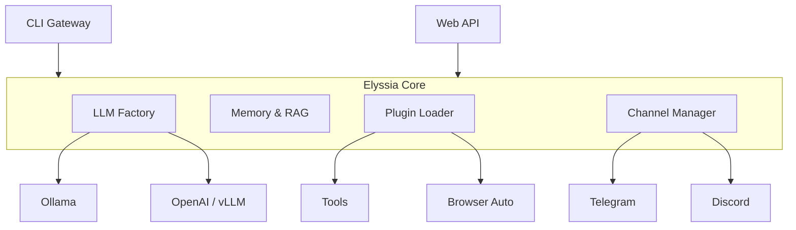

# ElyssiaAgent: Features Walkthrough

A complete guide to the new capabilities added to ElyssiaAgent.

## 0. Quick Start

Manage the entire system via the new CLI Gateway:

```bash
# 1. Run interactive setup wizard (configure models, channels)
python run.py --mode manage setup

# 2. Check system health
python run.py --mode manage status

# 3. Start the agent (CLI chat)
python run.py --mode chat

# 4. Start the backend (Web API)
python run.py --mode web
```

---

## 1. Plugin System (Phase 4A)

The agent now uses a modular plugin architecture. All tools are plugins.

- **Location**: `plugins/builtin/` and `plugins/community/`.
- **Structure**: Each plugin is a folder with `plugin.yaml` and `plugin.py`.
- **Management**:
  ```bash
  # List all plugins
  python run.py --mode manage plugin list
  
  # Install a plugin (not yet fully implemented, manual copy for now)
  python run.py --mode manage plugin install <path>
  ```

---

## 2. Multi-Channel Communication (Phase 4B)

Elyssia is now omnipresent. Connect her to Telegram and Discord.

- **Enable**: explicit `enabled: true` in `config/config.yaml`.
- **Configuration**:
  ```yaml
  channels:
    telegram:
      enabled: true
      bot_token: "YOUR_TELEGRAM_TOKEN"
    discord:
      enabled: true
      bot_token: "YOUR_DISCORD_TOKEN"
  ```
- **Features**:
  - Direct messages & Group mentions
  - Typing indicators
  - Image handling (future)
  - Commands: `/start`, `/help`, `/clear`

---

## 3. Model Flexibility (Phase 4C)

No longer locked to generic Ollama. Use any OpenAI-compatible backend.

- **Supported Backends**:
  - **Ollama** (Default, easiest for local)
  - **OpenAI-Compatible** (vLLM, Groq, LM Studio, LocalAI)
  - **LlamaCpp** (Native python binding)

- **Configuration**:
  ```yaml
  model:
    backend: "openai"  # or "ollama"
    name: "local-model"
    openai:
      base_url: "http://localhost:8000/v1"  # vLLM/LM Studio
      api_key: "sk-..." 
  ```

---

## 4. CLI Gateway & Security (Phase 4D)

A unified management interface with built-in safety rails.

- **Security**:
  - **Path Guard**: Plugins cannot read/write outside project root (except `/tmp`).
  - **Command Sentinel**: `rm -rf /` and other destructive commands are blocked by `src/core/security.py`.

---

## 5. Browser Automation (Phase 4E)

Elyssia can now browse the web interactively using Playwright.

- **Tools**:
  - `browser_open(url)`: Visit a page and read content.
  - `browser_click(selector)`: Click elements.
  - `browser_type(selector, text)`: Fill forms.
  - `browser_screenshot(filename)`: Capture visual state.
  - `browser_extract(selector)`: Scrape data.

- **Configuration**:
  ```yaml
  plugins:
    browser:
      headless: true  # Set to false to watch her browse!
  ```

---

## Architecture Overview


